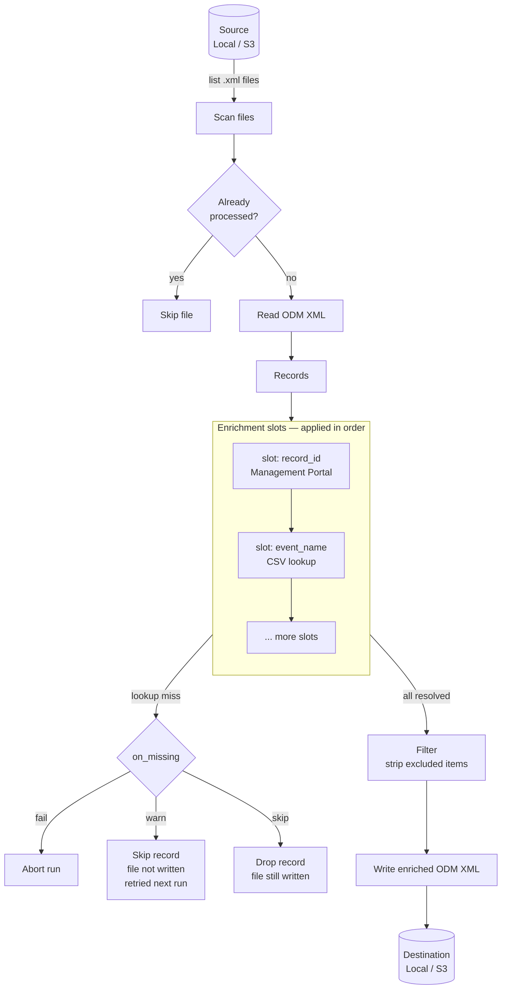

# radar-mapper

Reads ODM XML files produced by [radar-output-restructure](https://github.com/RADAR-base/radar-output-restructure), enriches subject identifiers and event names, and writes enriched ODM XML ready for downstream import (e.g. REDCap).

## How it works



For each `.xml` file found under `source.path`:

1. **Read** — parse ODM XML into records
2. **Enrich** — apply named enrichment slots in order; each slot resolves a lookup key from the record's fields and writes the result back
3. **Filter** — optionally strip unwanted item OIDs
4. **Write** — output enriched ODM XML to the same relative path under `destination.path`

Already-processed files are skipped on subsequent runs (idempotent). If any record in a file fails enrichment with `on_missing: warn`, the file is left unwritten so it is retried on the next run.

## Configuration

Copy `src/main/resources/mapper.yml` and fill in your values:

```yaml
source:
  type: local          # or s3
  path: /data/odm/

enrichment:
  - name: record_id
    source_field: SubjectKey
    output_field: SubjectKey
    provider:
      type: management_portal
      url: https://radar-base.example.com/managementportal
      client_id: radar_mapper
      client_secret: secret
      project: MY-PROJECT
      subject_attribute: REDCapRecordId
    on_missing: warn

  - name: event_name
    source_fields: [StudyEventOID, StudyOID]
    output_field: StudyEventOID
    provider:
      path: /config/event-lookup.csv
      key_columns: [questionnaireName, projectId]
      value_column: eventName
    on_missing: warn

destination:
  type: local          # or s3
  path: /data/output/
```

### Enrichment slots

Each slot under `enrichment` has:

| Field | Description |
|---|---|
| `name` | Slot identifier; result is stored under this name and can be referenced by later slots |
| `source_field` | Single record field used as the lookup key |
| `source_fields` | List of fields joined (tab-separated by default) to form a composite key |
| `output_field` | Field name to write the result into (defaults to `name`) |
| `provider` | Where to look up values — `csv` or `management_portal` |
| `on_missing` | `warn` (default), `skip`, or `fail` — see below |

### `on_missing` behaviour

| Value | Effect |
|---|---|
| `warn` | Log a warning and skip the record; file is **not** written so it retries on the next run |
| `skip` | Silently drop the record; file **is** written so the drop is permanent |
| `fail` | Abort the run immediately with an exception |

### Providers

**CSV** (`type: csv`, default):

```yaml
provider:
  path: /config/lookup.csv
  key_column: userId          # single key column
  # key_columns: [col1, col2] # composite key (tab-joined)
  value_column: recordId
```

**Management Portal** (`type: management_portal`):

```yaml
provider:
  type: management_portal
  url: https://radar-base.example.com/managementportal
  # token_url: http://radar-hydra-public:4444/oauth2/token  # Hydra deployments only
  client_id: radar_mapper
  client_secret: secret
  project: MY-PROJECT         # or projects: [A, B]
  subject_attribute: REDCapRecordId
```

### S3 storage

Both `source` and `destination` support S3-compatible storage:

```yaml
source:
  type: s3
  path: odm/
  s3:
    endpoint: https://minio.example.com
    bucket: radar-output
    access_token: KEY
    secret_key: SECRET
```

## Running

### Docker (recommended)

```bash
docker run --rm \
  -v /path/to/odm:/data/odm \
  -v /path/to/output:/data/output \
  -v /path/to/mapper.yml:/etc/radar-mapper/mapper.yml \
  radarbase/radar-mapper
```

The config path can also be overridden with the `MAPPER_CONFIG` environment variable.

### Gradle

```bash
gradle run --args="/path/to/mapper.yml"
```

### Building

```bash
gradle build
docker build -t radarbase/radar-mapper .
```

## Development

```bash
# Run tests
gradle test

# Check code style
gradle ktlintCheck
```

Tests require no external services — CSV enrichment and a local storage backend are used throughout.
